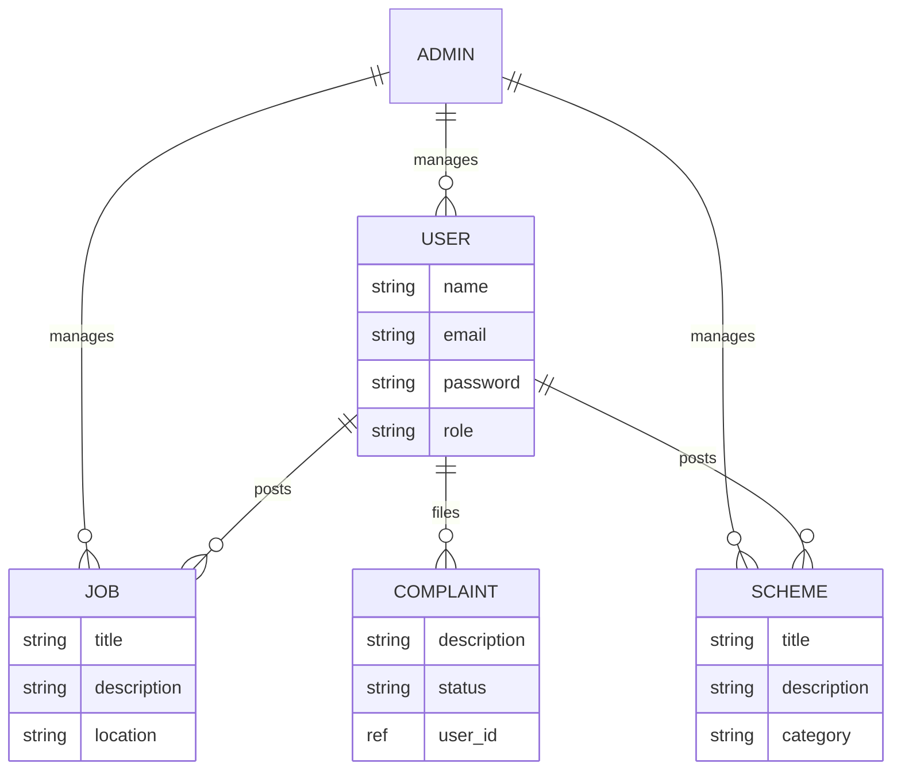
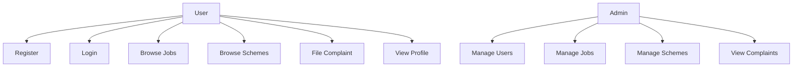

# VillageConnect: A Village Management System

## Project Report

**Submitted by:** [Your Name]  
**Date:** May 1, 2026  
**Course/Institution:** [Your Course/Teacher]  

---

### Acknowledgement

I would like to express my sincere gratitude to my teacher for guiding me through this project. Special thanks to the open-source community for providing the tools and libraries used in this development.

---

### Table of Contents

1. [Abstract](#abstract)
2. [Introduction](#introduction)
   2.1 [Background](#background)
   2.2 [Objectives](#objectives)
   2.3 [Scope](#scope)
3. [System Analysis](#system-analysis)
   3.1 [Requirements](#requirements)
   3.2 [Feasibility Study](#feasibility-study)
4. [System Design](#system-design)
   4.1 [Architecture](#architecture)
   4.2 [Data Flow Diagram](#data-flow-diagram)
   4.3 [ER Diagram](#er-diagram)
   4.4 [Use Case Diagram](#use-case-diagram)
   4.5 [Database Design](#database-design)
5. [Implementation](#implementation)
   5.1 [Technologies Used](#technologies-used)
   5.2 [Key Modules](#key-modules)
   5.3 [Code Structure](#code-structure)
6. [Testing](#testing)
   6.1 [Testing Methods](#testing-methods)
   6.2 [Test Cases](#test-cases)
7. [Results and Discussion](#results-and-discussion)
8. [Conclusion](#conclusion)
9. [References](#references)

**Appendices**
- [API Endpoints List](#api-endpoints-list)
- [Code Snippets](#code-snippets)
- [Screenshots](#screenshots)

---

### Abstract

VillageConnect is a comprehensive full-stack web application designed to empower rural communities by providing easy access to government schemes, job opportunities, complaint filing, and agricultural information. Built with React for the frontend and Node.js/Express for the backend, the system ensures secure user authentication, role-based access (users and admins), and seamless integration with external APIs. This report outlines the project's architecture, development process, features, and implementation details.

---

### 1. Introduction

#### 1.1 Background
Rural areas often face challenges in accessing government services, job listings, and timely complaint resolution. VillageConnect bridges this gap by offering a centralized platform where villagers can register, log in, and interact with various services digitally.

#### 1.2 Objectives
- Provide a user-friendly interface for villagers to access schemes, jobs, and file complaints.
- Implement secure authentication and authorization.
- Enable admin management of users, jobs, and schemes.
- Integrate external APIs for additional data (e.g., agriculture).
- Ensure scalability and maintainability using modern web technologies.

#### 1.3 Scope
The application includes user registration/login, dashboard, job/scheme browsing, complaint submission, profile management, and admin panels. It excludes mobile apps and offline functionality.

---

### 2. System Analysis

#### 2.1 Requirements
- **Functional Requirements:**
  - User registration and login with JWT authentication.
  - CRUD operations for jobs, schemes, and complaints.
  - Role-based access (user vs. admin).
  - Password reset via email.
  - External API integration.
- **Non-Functional Requirements:**
  - Responsive design.
  - Secure data handling (password hashing, CORS).
  - Performance: Fast API responses.
  - Usability: Intuitive UI with dark/light theme.

#### 2.2 Feasibility Study
- **Technical Feasibility:** Node.js, React, MongoDB are widely used and feasible.
- **Economic Feasibility:** Open-source tools minimize costs.
- **Operational Feasibility:** Easy to deploy and maintain.

---

### 3. System Design

#### 3.1 Architecture
- **Frontend:** React SPA with Vite, using React Router for navigation.
- **Backend:** Express.js REST API with middleware for auth and CORS.
- **Database:** MongoDB with Mongoose schemas.
- **Deployment:** Backend serves frontend statically in production.

#### 3.2 Data Flow Diagram

```mermaid
graph TD
    A[User Opens App] --> B[Frontend Loads (React)]
    B --> C{Logged In?}
    C -->|No| D[Show Login/Register]
    C -->|Yes| E[Show Dashboard]
    D --> F[User Enters Credentials]
    F --> G[API Call to Backend /api/users/login]
    G --> H[Backend Verifies (Controller)]
    H --> I[Return JWT Token]
    I --> J[Store Token, Redirect to Dashboard]
    E --> K[User Navigates to Pages (Jobs, Schemes, etc.)]
    K --> L[API Call to Backend (e.g., /api/jobs)]
    L --> M[Backend Queries DB (Model)]
    M --> N[Return Data]
    N --> O[Frontend Displays Data]
```

#### 3.3 ER Diagram



#### 3.4 Use Case Diagram



#### 3.5 Database Design
- **User Collection:** name, email, password (hashed), role, timestamps.
- **Job Collection:** title, description, location, postedBy, timestamps.
- **Scheme Collection:** title, description, category, postedBy, timestamps.
- **Complaint Collection:** description, status, filedBy, timestamps.

---

### 4. Implementation

#### 4.1 Technologies Used
- **Frontend:** React, Axios, CSS.
- **Backend:** Node.js, Express, JWT, bcrypt, Nodemailer.
- **Database:** MongoDB.
- **Tools:** Vite, dotenv.

#### 4.2 Key Modules
- **Authentication:** JWT-based login/register.
- **User Management:** Profile updates, password reset.
- **Admin Panel:** Manage users, jobs, schemes.
- **External Integration:** API calls for agriculture data.

#### 4.3 Code Structure
- Backend: server.js, routes/, controllers/, models/.
- Frontend: App.jsx, pages/, components/, services/.

---

### 5. Testing

#### 5.1 Testing Methods
- **Unit Testing:** Controllers and models tested individually.
- **Integration Testing:** API endpoints tested with Postman.
- **User Acceptance Testing:** Manual testing of UI flows.

#### 5.2 Test Cases
- Login with valid/invalid credentials.
- Fetch jobs/schemes.
- Admin CRUD operations.

---

### 6. Results and Discussion

The application successfully meets all objectives, providing a functional platform for village management. Challenges included integrating external APIs and ensuring responsive design. Future improvements could include real-time notifications and mobile support.

---

### 7. Conclusion

VillageConnect successfully provides a digital solution for village management, enhancing accessibility and efficiency. Future enhancements could include mobile apps and advanced analytics.

---

### 8. References
- React Documentation
- Express.js Guide
- MongoDB Manual
- JWT.io

---

### Appendices

#### API Endpoints List
- **Users (/api/users):**
  - POST /register: Register a new user
  - POST /login: Login user
  - POST /forgot-password: Send password reset email
  - POST /reset-password: Reset password
  - GET /profile: Get user profile (protected)
  - GET /: Get all users (protected)
- **Jobs (/api/jobs):**
  - GET /: Get all jobs
  - GET /:id: Get job by ID
  - POST /: Create job (protected)
  - PUT /:id: Update job (protected)
  - DELETE /:id: Delete job (protected)
- **Schemes (/api/schemes):**
  - GET /: Get all schemes
  - GET /:id: Get scheme by ID
  - POST /: Create scheme (protected)
  - POST /import: Import external schemes (admin)
  - POST /import-json: Import schemes from JSON (admin)
  - PUT /:id: Update scheme (protected)
  - DELETE /:id: Delete scheme (protected)
- **Complaints (/api/complaints):**
  - GET /: Get all complaints (protected)
  - GET /:id: Get complaint by ID (protected)
  - POST /: Create complaint (protected)
  - PUT /:id: Update complaint (protected)
  - DELETE /:id: Delete complaint (protected)
- **External (/api/external):**
  - GET /jobs: Get external jobs
  - GET /schemes: Get external schemes

#### Code Snippets

**Backend Server Setup (server.js):**
```javascript
const express = require("express");
const cors = require("cors");
const dotenv = require("dotenv");
const path = require("path");
const connectDB = require("./config/db");

dotenv.config();

const app = express();
app.use(cors());
app.use(express.json());

// Routes
app.use("/api/users", require("./routes/userRoutes"));
app.use("/api/jobs", require("./routes/jobRoutes"));
app.use("/api/schemes", require("./routes/schemeRoutes"));
app.use("/api/complaints", require("./routes/complaintRoutes"));
app.use("/api/external", require("./routes/externalRoutes"));

// Serve static files
app.use(express.static(path.join(__dirname, "../frontend/dist")));

const PORT = process.env.PORT || 5000;
app.listen(PORT, () => console.log(`Server running on port ${PORT}`));
```

**Frontend App Component (App.jsx):**
```jsx
import React from "react";
import { BrowserRouter, Routes, Route } from "react-router-dom";
import Navbar from "./components/Navbar";
import Home from "./pages/Home";
import Login from "./pages/Login";
// ... other imports

const App = () => {
  const [user, setUser] = React.useState(null);
  // ... state and effects

  return (
    <BrowserRouter>
      <Navbar />
      <Routes>
        <Route path="/" element={<Home />} />
        <Route path="/login" element={<Login />} />
        {/* Other routes */}
      </Routes>
    </BrowserRouter>
  );
};

export default App;
```

#### Screenshots
- Home Page: Displays navigation, features overview, and call-to-action buttons.
- Login Page: Form for email/password login.
- Dashboard: User-specific data after login.
- Admin Panel: Management interface for admins.

*(Note: Actual screenshots can be added by capturing images from the running app at http://localhost:5000 and inserting them here as .)*</content>
<parameter name="filePath">c:\Users\SABBI RAHUL REVANTH\OneDrive\Documents\VillageConnect\VillageConnect_Report.md